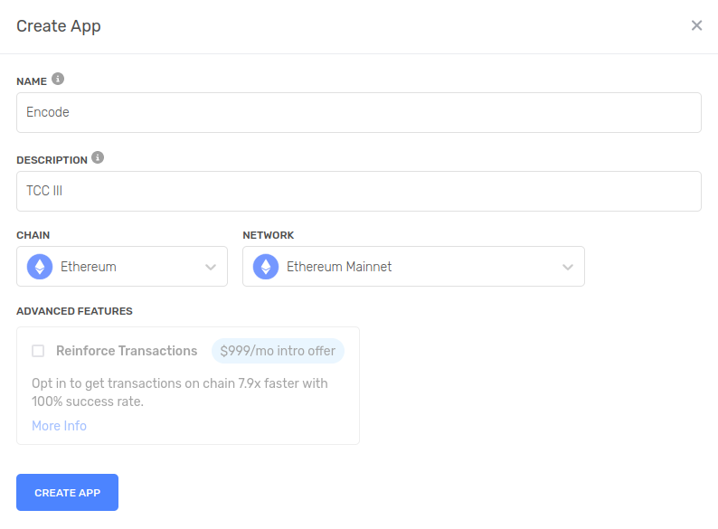
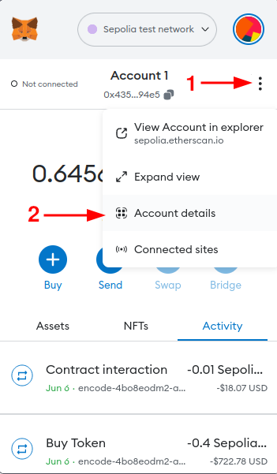

# Smart contract da aplicação Encode

## Descrição

Este repositório contém o smart contract da aplicação Encode.

Este arquivo irá detalhar os passos necessários para realizar o deploy do contrato inteligente na testnet Sepolia da rede Ethereum.

## Pré-requisitos

### Alchemy

A Alchemy é uma API que permite que desenvolvedores criem aplicativos para o blockchain sem precisar rodar um nó completo, e foi utilizada para realizar o deploy deste contrato.

Para utilizar a Alchemy, é necessário criar uma conta no site [https://www.alchemy.com/](https://www.alchemy.com/).

Após criar a conta, é necessário criar um novo projeto. O nome e descrição do projeto não importam, mas é necessário selecionar Ethereum na opção "Chain", e a rede "Ethereum Sepolia".

Após criar o projeto, selecione a opção "View Key" e copie a URL HTTPS que aparecerá na tela.

Cole essa informação em um arquivo .env na raiz do projeto, com o nome de `ALCHEMY_SEPOLIA_URL`.

### Carteira Ethereum

#### Criação da carteira

Para realizar o deploy do contrato, é necessário ter uma carteira Ethereum com saldo na rede Sepolia.

Para criar a conta, faça o download da extensão MetaMask para o seu navegador, e crie uma nova conta.

Após criar a conta, selecione a opção "Account Details" e copie a chave privada da conta.

Cole essa chave privada em um arquivo .env na raiz do projeto, com o nome de `SEPOLIA_WALLET_PRIVATE_KEY`.

#### Adicionando saldo na Carteira

Para adicionar saldo na carteira, acesse o site [https://sepoliafaucet.com/](https://sepoliafaucet.com/) e cole o endereço da carteira no campo "Enter your wallet address...". Aqui será necessário vincular sua conta Alchemy, criada anteriormente.

É permitido adicionar 0.5 Sepolia ETH por dia.

### Deploy do contrato

Para realizar o deploy do contrato, é necessário ter o Node.js instalado na máquina. Para o desenvolvimento, foi utilizada a versão 18.15.0 LTS da ferramenta.

É necessário também o gerenciador de pacotes pnpm, que pode ser instalado através do comando `npm install -g pnpm` ou através das orientações presentes na [documentação oficial](https://pnpm.io/installation).

Após instalar o Node.js e o pnpm, execute o comando `pnpm install` para instalar as dependências do projeto.

Após instalar as dependências, execute o comando `pnpm hardhat run scripts/deploy.js --network sepolia` para realizar o deploy do contrato.

Após o deploy, copie o endereço do contrato e cole no arquivo .env na raiz do projeto frontend, com o nome de `NEXT_PUBLIC_CONTRACT_ADDRESS`.
